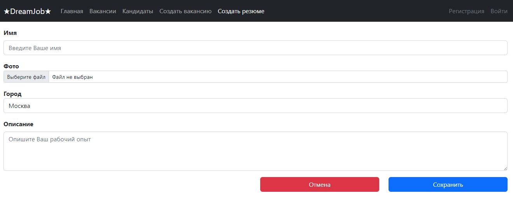
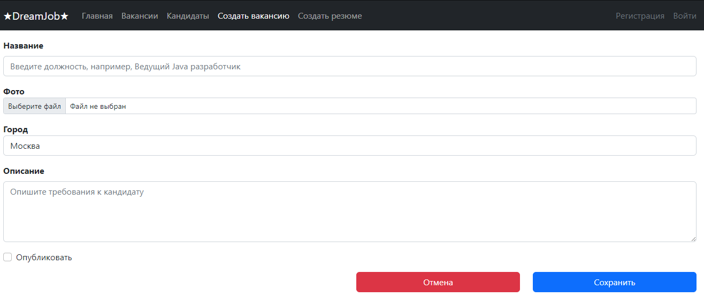
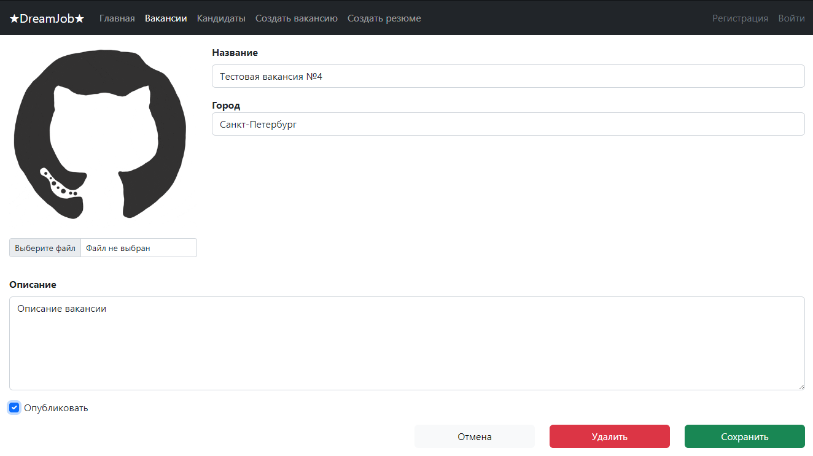
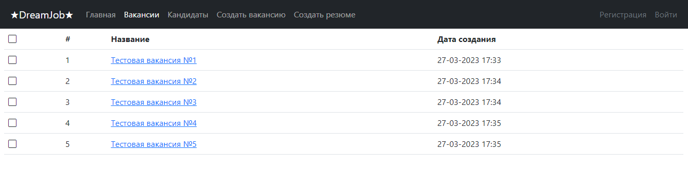
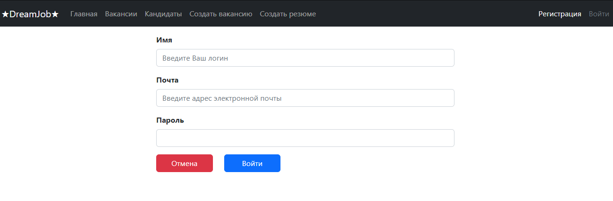
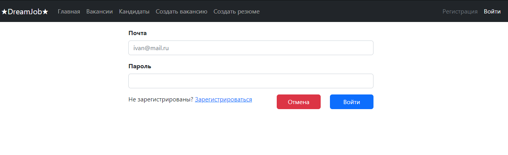
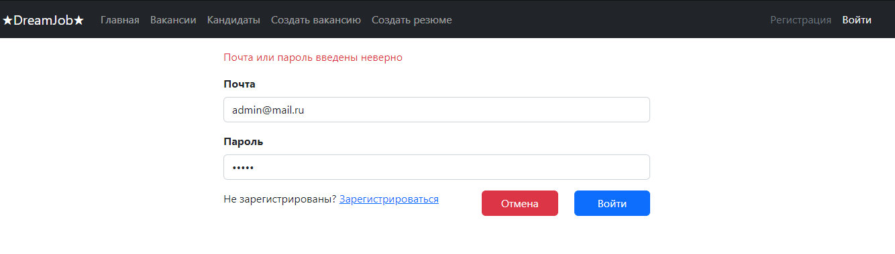

# Проект "Dream Job" (В процессе разработки)

* [Описание](#описание)
* [Функционал](#функционал)
* [Технологии](#технологии)
* [Интерфейс](#интерфейс)
* [Автор](#автор)

## Описание

MVC приложение на Spring Boot и Thymeleaf, реализующее биржу
вакансий и кандидатов.

## Функционал

* Регистрация пользователя;
* Аутентификация;
* Авторизация через БД PostgreSQL;
* Добавление/изменение/удаление вакансий;
* Добавление/изменение/удаление соискателей;
* Возможность работы с фотографиями профилей;
* Две модели хранения данных:
  - Хранение в оперативной памяти (реализация репозитория Memory#Repository);
  - Хранение в базе данных PostgreSQL (реализация репозитория Sql2o#Repository).

## Технологии

* Java 18;
* Spring boot;
* PostgreSQL;
* Sql2o (ORM) + commons-dbcp2(connection pool);
* Apache Tomcat Server;
* Thymeleaf;
* HTML, CSS, Bootstrap;
* Log4j;
* Тесты: Junit5, Mockito. Работают c H2 db;
* Maven. Поддержка профилей test/prod;
* Liquibase.

## Интерфейс

* Добавление кандидата
  

* Добавление вакансии
  

* Редактирование вакансии
  

* Список вакансий
  

* Регистрация
  

* Авторизация
  

* Проверка подлиности пароля
  

## Автор

Michael Zalogin

zaloginmiha@gmail.com

+79111480757

